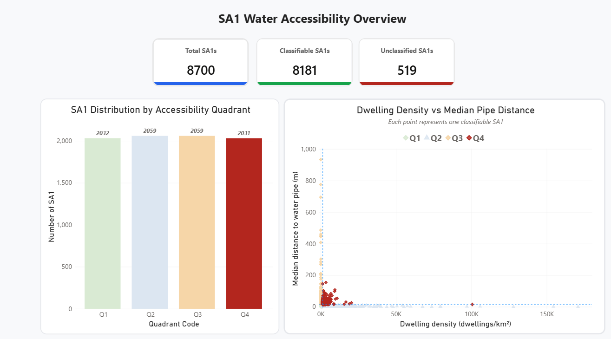
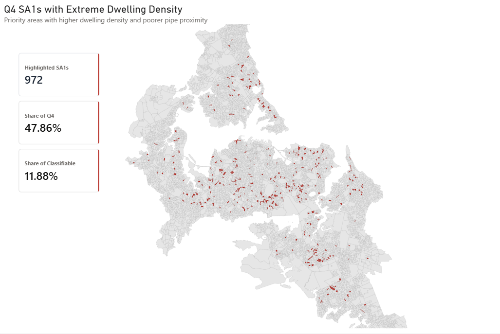
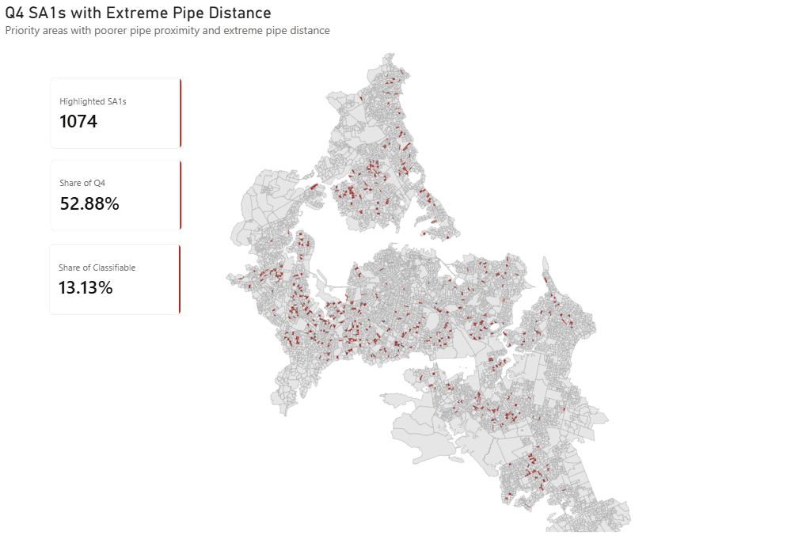
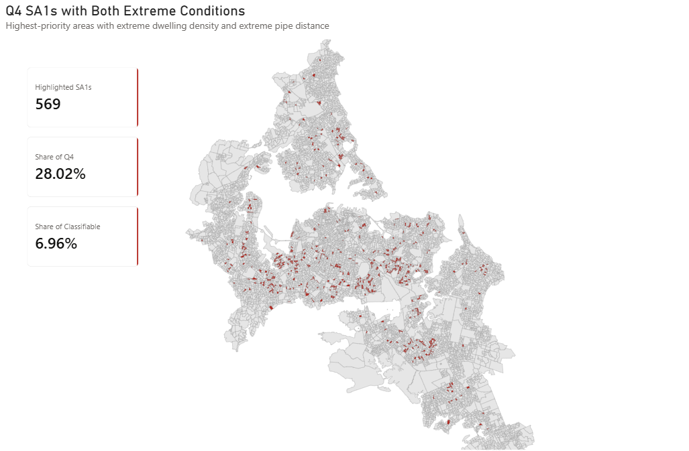
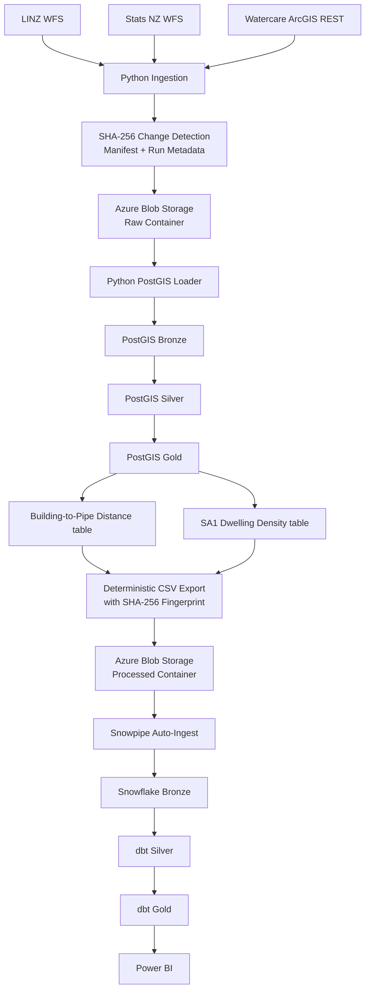
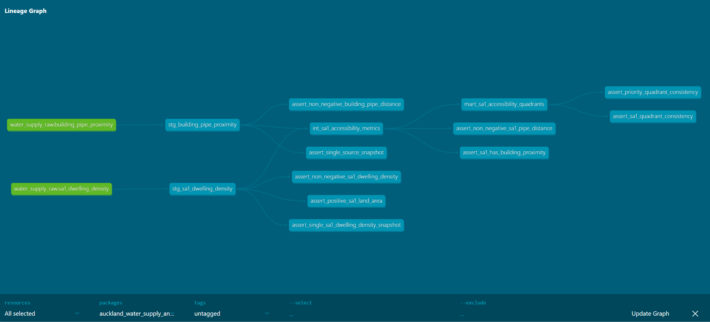

# Auckland Potable Water Accessibility Analysis

## Overview

An end-to-end **geospatial data engineering and analytics** project for identifying **Auckland urban SA1 areas** that may warrant further investigation for **potential potable-water supply risk**, based on **building-to-nearest-local-potable-water-pipe distance** and **residential density**.



---

## Motivation

This project was motivated by my own living experience. My home is located in a residential building complex that is connected to the main potable-water network through a connection pipe of approximately 2 km. Even when the local connection pipe within the complex is functioning normally, maintenance work or failures on the upstream main pipe can still interrupt the water supply.

This experience led me to consider whether residential areas located farther from the local potable-water distribution network may be more exposed to water-supply disruption, especially when residential density is also high.

---

## Objective

This project has two main objectives:

### 1. Identify SA1 areas that should be prioritised for further investigation

Develop a data-driven classification method to identify Auckland urban SA1 areas with relatively longer building-to-pipe distances and higher occupied-dwelling density.

### 2. Build a production-oriented end-to-end data pipeline

Design and implement a traceable, reproducible, idempotent, and increasingly automated pipeline that can process source-data changes consistently through spatial processing, warehousing, transformation, and BI layers.

---

## Methodology

### 1. Analytical Methodology

The initial intention was to identify a **clear, deterministic metric or established threshold** that could directly translate the combination of **building-to-pipe distance** and **residential density** into different investigation-priority levels.

However, I could not identify a defensible external metric that specifies, for example, that a particular pipe distance combined with a particular dwelling density should automatically correspond to a specific level of potable-water supply risk or investigation priority.

Because the two variables also have different units and distributions, defining arbitrary fixed thresholds would have introduced assumptions that were difficult to justify.

Therefore, instead of imposing a predetermined scoring formula, the analysis shifted to a **data-driven statistical classification approach** based on the observed distribution of the Auckland SA1 data.

The analytical process is:

1. Calculate the nearest eligible potable-water pipe distance for each building.
2. Aggregate building-level distances to the SA1 level.
3. Calculate occupied-dwelling density for each SA1.
4. Analyse the statistical distribution of both SA1-level metrics.
5. Use median thresholds to divide SA1s into four quadrants.
6. Use 75th-percentile thresholds to identify more extreme conditions.

#### Building-to-Pipe Distance

For each building, the distance to its **nearest local potable-water distribution pipe** is calculated using the complete building footprint and pipe geometry.

The building-level distances are then aggregated to the **SA1 level**, and the **median building-to-pipe distance** is calculated for each SA1.

The median is used as the primary SA1-level proximity metric because it provides a robust representation of the typical building-to-pipe distance within each SA1 while reducing the influence of unusually large individual distances.

#### Occupied-Dwelling Density

Separately, **occupied-dwelling density** is calculated for each SA1 using the 2023 Census occupied-dwelling count divided by SA1 land area:

`occupied-dwelling density = occupied_dwellings_2023 / land_area_sq_km`

The unit is **occupied dwellings per km²**.

#### Median-Based Quadrant Classification

Rather than applying unsupported absolute risk thresholds, the analysis derives two median thresholds from all classifiable SA1s:

- **Median of SA1 median building-to-pipe distance**
- **Median of SA1 occupied-dwelling density**

These thresholds divide the dataset into four quadrants:

| Quadrant | Dwelling Density | Median Building-to-Pipe Distance | Interpretation |
|---|---|---|---|
| Q1 | Lower | Lower | Lower density / shorter pipe distance |
| Q2 | Higher | Lower | Higher density / shorter pipe distance |
| Q3 | Lower | Higher | Lower density / longer pipe distance |
| **Q4** | **Higher** | **Higher** | **Higher density / longer pipe distance** |

Each classifiable SA1 is assigned to one of the four quadrants according to its relative position within the Auckland urban dataset.

**Q4** is treated as the primary priority group because it combines:

- relatively higher occupied-dwelling density; and
- relatively longer median building-to-pipe distance.

This classification should be interpreted as a **relative analytical screening method**, rather than a deterministic measure of actual water-supply failure risk.

#### P75 Extreme-Condition Screening

The **75th-percentile (P75) thresholds** are then applied as a stricter second-level screening method.

| Extreme Condition | Median Building-to-Pipe Distance | Dwelling Density | Interpretation |
|---|---|---|---|
| Extreme Pipe Distance | ≥ P75 | Any | SA1 has an unusually long median building-to-pipe distance |
| Extreme Dwelling Density | Any | ≥ P75 | SA1 has unusually high occupied-dwelling density |
| **Both Extreme Conditions** | **≥ P75** | **≥ P75** | **SA1 has both unusually long pipe distance and unusually high dwelling density** |

The P75 thresholds therefore provide a stricter level of screening than the median-based quadrant classification.

SA1s exceeding both P75 thresholds represent the most extreme observed combination of:

- **long building-to-pipe distance**; and
- **high occupied-dwelling density**.

The methodology can therefore be summarised as:

**Initial intention**  
→ Find a deterministic distance + density priority metric  
→ No defensible established metric identified  
→ Analyse the observed SA1 statistical distributions  
→ Use median thresholds to construct four quadrants  
→ Use P75 thresholds to identify more extreme conditions

### 2. Data Engineering Methodology

The pipeline is designed as a reusable **cloud-based data engineering workflow** rather than a one-off analysis.

The main principles are:

- **Layered design** — each stage has a clear responsibility across ingestion, spatial processing, cloud storage, warehousing, transformation, validation, and visualisation.
- **Configuration-driven processing** — dataset sources, filters, CRS, pagination, and dependencies are defined in configuration files instead of being hard-coded.
- **Reproducible processing** — spatial rules, SQL transformations, dbt models, and export logic are explicitly defined so the same inputs produce consistent results.
- **Change detection and idempotency** — SHA-256 fingerprints are used to detect meaningful data changes and avoid unnecessary reprocessing of unchanged data.
- **Traceability and lineage** — run IDs, timestamps, manifests, source filenames, Snowpipe metadata, and dbt lineage are retained so analytical results can be traced back to their source.
- **Data-quality validation** — checks are applied throughout PostGIS and dbt to detect invalid geometries, incorrect values, duplicate records, and inconsistent analytical results.
- **Use the right platform for each workload** — PostGIS handles spatial computation, Azure Blob Storage provides cloud-based data exchange between stages, and Snowflake/dbt handles analytical transformation and modelling.

---

# Analysis Results

## 1. SA1 Potable-Water Supply Risk Overview


The final analytical mart contains **8,700 SA1 areas**, of which **8,181 are classifiable** and **519 are unclassified** because one or both required metrics are unavailable.

The scatter chart plots each classifiable SA1 using:

- **X-axis:** occupied-dwelling density
- **Y-axis:** median building-to-pipe distance

Median thresholds divide the SA1s into four quadrants. Most data points appear clustered because a small number of SA1s have extreme dwelling-density or pipe-distance values, which expand the scale of the chart.

**Q4 contains 2,030 SA1s** and is treated as the **primary priority quadrant**.

---

## 2. Q4 SA1s with Extreme Dwelling Density



**972 Q4 SA1s** are at or above the **P75 dwelling-density threshold**.

- **47.86% of Q4 SA1s**
- **11.88% of all classifiable SA1s**

These areas combine longer pipe distance with particularly high residential density.

---

## 3. Q4 SA1s with Extreme Pipe Distance



**1,074 Q4 SA1s** are at or above the **P75 median pipe-distance threshold**.

- **52.88% of Q4 SA1s**
- **13.13% of all classifiable SA1s**

These areas combine high residential density with particularly long building-to-pipe distance.

---

## 4. Q4 SA1s with Both Extreme Conditions



**569 Q4 SA1s** exceed both P75 thresholds for:

- **occupied-dwelling density**
- **median building-to-pipe distance**

They represent:

- **28.02% of Q4 SA1s**
- **6.96% of all classifiable SA1s**

These SA1s form the project's **highest-priority analytical group**, combining unusually high residential density with unusually long building-to-pipe distance.

---

# Architecture

The project uses a layered end-to-end architecture that separates **data ingestion, spatial processing, analytical warehousing, transformation, and visualisation**.



---

# Data Sources

The ingestion pipeline currently processes four spatial datasets:

| Dataset | Provider | Access Method | Main Purpose |
|---|---|---|---|
| [NZ Building Outlines](https://data.linz.govt.nz/layer/101290-nz-building-outlines/) | LINZ | WFS | Residential/building footprints |
| [Urban Rural 2026](https://datafinder.stats.govt.nz/layer/123505-urban-rural-2026/) | Stats NZ | WFS | Auckland urban analysis boundary |
| [2023 Census totals by topic for dwellings by statistical area 1](https://datafinder.stats.govt.nz/layer/120759-2023-census-totals-by-topic-for-dwellings-by-statistical-area-1/) | Stats NZ | WFS | Occupied-dwelling density |
| [Water Pipe](https://data-watercare.opendata.arcgis.com/datasets/Watercare::water-pipe/about) | Watercare | ArcGIS REST | Potable-water-pipe proximity |

The ingestion configuration defines source type, CRS, pagination, filters, and dataset dependencies in [`config/datasets.yaml`](config/datasets.yaml).

All spatial processing uses **NZTM2000 / EPSG:2193** so that calculated distances are measured in metres.

---

# Pipeline Implementation

## 1. Python Source Ingestion

The Python ingestion layer retrieves data from both:

```text
WFS
ArcGIS REST
```

and supports:

- source-specific pagination;
- HTTP retry handling;
- BBOX and attribute filtering;
- API-key redaction from logs;
- dataset dependency resolution;
- CRS-aware spatial extraction;
- run-specific metadata;
- Azure Blob Storage uploads.

The ingestion process is configuration-driven, allowing multiple datasets and source technologies to be handled through one reusable pipeline.

---

## 2. SHA-256 Change Detection and Traceability

The ingestion layer calculates two forms of SHA-256 hash:

```text
Raw file SHA-256
Content SHA-256
```

The raw hash verifies the downloaded bytes.

The content hash removes volatile JSON metadata such as request timestamps and pagination links before hashing, preventing irrelevant response changes from being interpreted as source-data changes. 

Page-level content hashes are then combined into a dataset-level fingerprint used for change detection. 

Each ingestion run also writes a manifest containing information such as:

```text
run_id
downloaded_at
provider
dataset
source configuration
BBOX
record counts
page hashes
dataset SHA-256
previous run
change status
```

This makes source-data ingestion traceable and enables downstream processing to respond to meaningful source-data changes.

---

# PostGIS Spatial Processing

PostGIS is used as the spatial-computation engine.

## Bronze — Staging

Raw data retrieved from Azure Blob Storage is loaded into staging tables.

This layer handles:

- raw-source validation;
- attribute type conversion;
- CRS normalization;
- geometry preparation;
- ingestion metadata.

---

## Silver — Core

The core layer creates standardized spatial datasets for analysis.

Key operations include:

- geometry validation;
- `ST_MakeValid`;
- geometry-type normalization;
- EPSG:2193 enforcement;
- Auckland urban-area filtering;
- creation of representative points;
- primary-key and check constraints;
- GiST spatial indexes.

Building outlines are retained when they intersect the Auckland analysis boundary, while `ST_PointOnSurface()` creates a representative point for downstream SA1 assignment.

Census SA1 polygons are retained using a representative-point-based boundary rule, while water and ocean classifications are excluded.

---

## Gold — Spatial Analysis

The PostGIS analytical layer generates two analytical datasets:

```text
analysis.building_pipe_proximity
analysis.sa1_dwelling_density
```

These two tables are exported from PostGIS as deterministic CSV files and loaded into the Snowflake Bronze / RAW layer, where they become the source datasets for downstream dbt transformation and SA1-level analytical modelling.

---

# Water-Pipe Eligibility

Only **operational local potable-water distribution pipes** are included in the analysis. Service connections and other non-relevant pipe categories are excluded.

A GiST spatial index supports efficient nearest-pipe searching.

---

# Building-to-Pipe Distance

Building-level proximity is an **intermediate spatial calculation** used to derive the final SA1 metrics.

## SA1 Assignment

Each building is assigned to an SA1 using its representative point:

```sql
ST_Covers(
    sa1.geometry,
    building.representative_point
)
```

The representative point is used only for SA1 assignment.

## Nearest-Pipe Search

The nearest eligible pipe is identified using a GiST-assisted K-nearest-neighbour search:

```sql
ORDER BY
    pipe.geometry <-> building.geometry
LIMIT 1
```

The final distance is then calculated between the **complete building footprint** and the **complete pipe geometry**:

```sql
ST_Distance(
    building.geometry,
    pipe.geometry
)
```

Using the building footprint rather than its representative point ensures that the metric represents the shortest geometric distance from the actual building geometry to the pipe network.

---

# SA1 Dwelling Density

Occupied-dwelling density is calculated as:

```text
occupied_dwellings_2023
────────────────────────
land_area_sq_km
```

The unit is:

```text
occupied dwellings / km²
```

Unavailable Census values remain `NULL` rather than being interpreted as zero.

---

# PostGIS to Snowflake

The two PostGIS analytical outputs are exported as deterministic CSV files:

```text
building_pipe_proximity
sa1_dwelling_density
```

Geometry columns remain in PostGIS and are not exported to Snowflake because the downstream warehouse layer operates on analytical attributes rather than performing additional spatial computation. 

Rows are exported in deterministic order before SHA-256 calculation so that the same analytical content generates the same file fingerprint.

The files are uploaded to the processed Azure Blob Storage container.

---

# Snowflake Bronze Layer

Snowflake contains two RAW ingestion tables:

```text
RAW.BUILDING_PIPE_PROXIMITY
RAW.SA1_DWELLING_DENSITY
```

Source-lineage attributes are retained alongside the analytical fields:

```text
source_filename
source_file_row_number
source_file_last_modified
snowpipe_loaded_at
```

**Azure external storage integration** and an **external Snowflake stage** connect Snowflake to the processed Blob Storage layer.

Separate Snowpipes automatically ingest each analytical dataset using `AUTO_INGEST = TRUE`.

---

# dbt Silver Layer

The dbt Silver layer contains:

```text
stg_building_pipe_proximity
stg_sa1_dwelling_density
int_sa1_accessibility_metrics
```

The staging models:

- select the latest source snapshot;
- convert RAW string values to analytical data types;
- preserve source-file metadata.

The intermediate model aggregates building-level distances into SA1-level statistics:

```text
building_count
average pipe distance
median pipe distance
P75 pipe distance
minimum pipe distance
maximum pipe distance
```

These metrics are then joined to SA1 dwelling density so that the analytical grain becomes:

> **one row per SA1**

---

# dbt Gold Layer

The final analytical model is:

```text
mart_sa1_accessibility_quadrants
```



The Gold mart classifies each eligible SA1 using:

```text
median pipe distance
+
dwelling density
```

SA1s missing either metric are marked:

```text
UNCLASSIFIED
```

---


# Data Quality and Validation

Validation is implemented across multiple systems.

## PostGIS Validation

PostGIS SQL validates:

- non-empty result tables;
- geometry validity;
- geometry type;
- EPSG:2193;
- primary-key uniqueness;
- non-negative calculated distance;
- expected source/result row counts;
- potable-water-pipe business rules.

For example, every core building is expected to generate exactly one building-pipe distance record, and negative or missing distance values cause the analysis to fail.

## dbt Tests

The dbt project includes schema tests and custom singular tests such as:

```text
assert_non_negative_building_pipe_distance
assert_non_negative_sa1_dwelling_density
assert_non_negative_sa1_pipe_distance
assert_positive_sa1_land_area
assert_single_source_snapshot
assert_single_sa1_dwelling_density_snapshot
assert_sa1_has_building_proximity
assert_sa1_quadrant_consistency
assert_priority_quadrant_consistency
```

For example, all aggregated SA1 pipe-distance metrics are required to be non-negative. 

The priority flag is also validated against the quadrant classification:

```text
Q4           → priority = true
Q1/Q2/Q3     → priority = false
UNCLASSIFIED → priority = null
```

---

# Technology Stack

| Layer | Technology / Service |
|---|---|
| Spatial source APIs | WFS, ArcGIS REST |
| Programming | Python 3.12 |
| Geospatial Python processing | GeoPandas |
| Spatial database | PostgreSQL + PostGIS |
| Cloud storage | Azure Blob Storage |
| Change detection | SHA-256 hashing |
| Configuration | YAML |
| Warehouse ingestion | Snowpipe |
| Data warehouse | Snowflake |
| Transformation and modelling | dbt Core |
| Data quality | PostGIS validation, dbt tests |
| Visualisation | Power BI |
| Spatial reference system | NZTM2000 / EPSG:2193 |

---